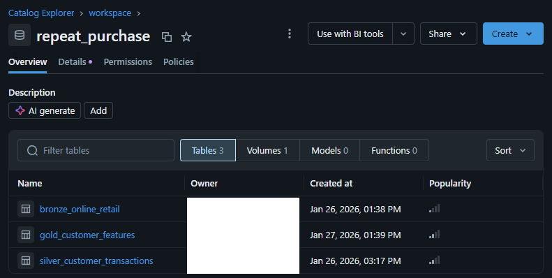
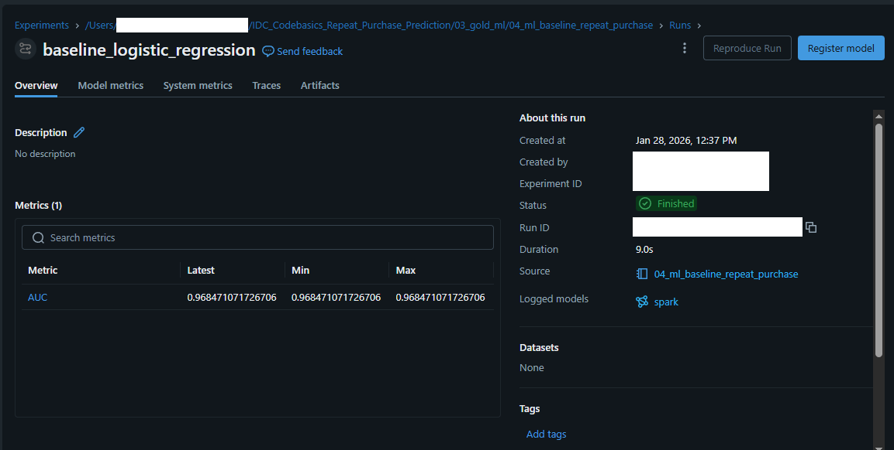
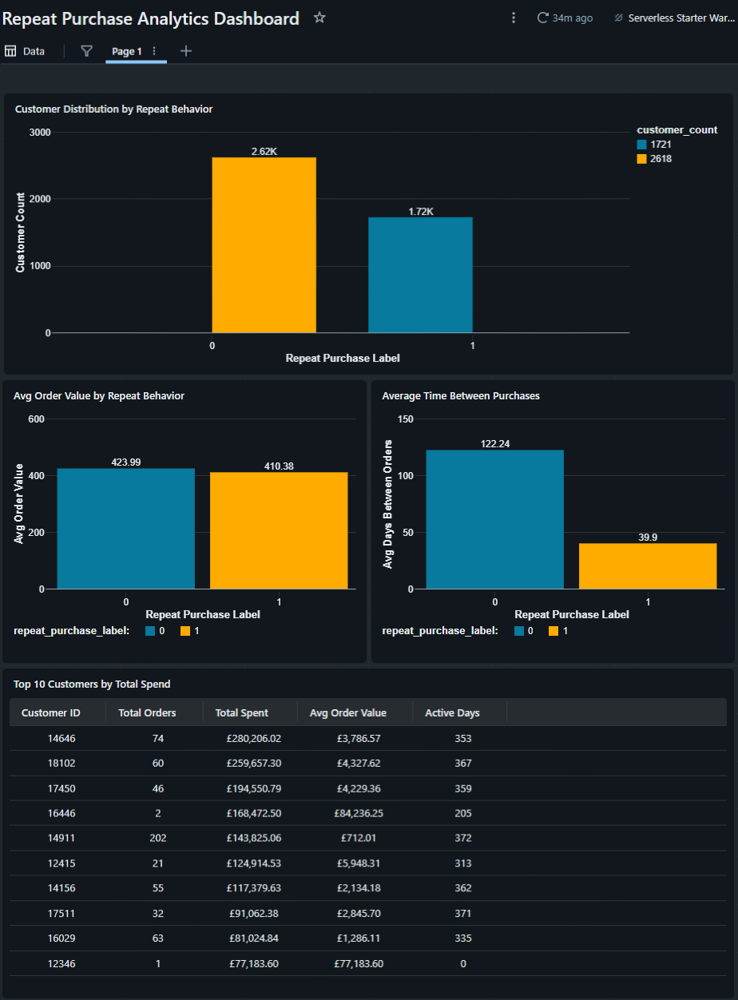
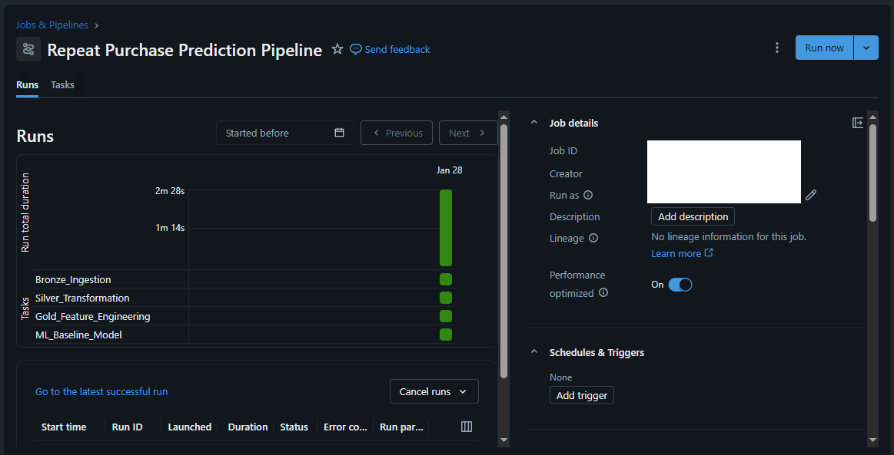

# Repeat Purchase Prediction using Databricks

## Project Overview

This project focuses on predicting whether a customer will make a **repeat purchase within 30 days** using historical e-commerce transaction data.

The main goal of this project is to **learn and demonstrate** how to build an end-to-end analytics and ML workflow using Databricks, starting from raw data ingestion to insights and a baseline ML model.

This project was built as part of the **Codebasics / Indian Data Club Databricks Challenge**.

---

## Dataset Information

**Dataset name:**  
Online Retail Dataset

**Full official name:**  
Online Retail Data Set (UCI Machine Learning Repository)

**Source:**  
https://archive.ics.uci.edu/ml/datasets/Online+Retail

**Description:**  
The dataset contains transaction-level data from a UK-based online retail store. It includes information such as invoices, products, quantities, prices, customer IDs, and purchase dates.

**Time period covered:**  
December 2010 – December 2011

**Dataset used in this project:**
- File format: CSV (converted from Excel)
- File size: ~43.9 MB
- Number of rows: ~541,000 transactions
- Number of columns: 8

**Why this dataset was chosen:**
- Public and well-documented
- Contains customer-level transaction history
- Suitable for repeat purchase analysis
- Easy to understand and explain as a beginner

---

## Problem Statement

**Business question:**  
Can we predict whether a customer will place another order within **30 days** of their last purchase?

**ML objective:**  
Binary classification:
- `1` → Customer makes a repeat purchase within 30 days  
- `0` → Customer does not make a repeat purchase within 30 days

This problem is practical for e-commerce and simple enough to explain clearly without overcomplicating the solution.

---

## Architecture Overview

The project follows the **Medallion Architecture** using **Delta Lake**:

Bronze → Silver → Gold → Machine Learning

---

## 🥉 Bronze Layer (Raw Data)

**Purpose:**  
Store raw data in its original form with minimal changes.

**What is done:**
- Raw CSV file is loaded from a Unity Catalog Volume
- Schema is inferred
- Data is stored as a Bronze Delta table

**Notebook used:**
- `01_bronze_online_retail_ingestion`

---

## 🥈 Silver Layer (Cleaned & Structured Data)

**Purpose:**  
Clean and prepare data for feature engineering.

**Key transformations:**
- Convert invoice date to timestamp
- Remove records with missing customer IDs
- Remove invalid quantities
- Aggregate data at order level
- Calculate total order value per invoice

**Notebook used:**
- `02_silver_customer_transactions`

---

## 🥇 Gold Layer (Feature Engineering)

**Purpose:**  
Create customer-level features for analytics and machine learning.

**Features created:**
- Total number of orders
- Average order value
- Average days between orders
- Number of active days
- First order date
- Last order date
- Repeat purchase label (30-day window)

**Notebook used:**
- `03_gold_repeat_purchase_features`

---

## Delta Tables (Medallion Layers)

All Bronze, Silver, and Gold layers are stored as **Delta tables** in Unity Catalog.

This ensures:
- ACID transactions
- Reliability
- Easy querying and reuse across analytics and ML

📸 **Delta Tables (Bronze / Silver / Gold)**

---

## Repeat Purchase Definition

A customer is marked as a **repeat purchaser (label = 1)** if they place another order **within 30 days** of a previous order.

Otherwise, the label is **0**.

**Why 30 days?**
- Common business definition for short-term repeat behavior
- Keeps the problem realistic and simple
- Avoids unnecessary complexity for a learning-focused project

---

## Machine Learning (Baseline Model)

**Model used:**  
Logistic Regression

**Why this model was chosen:**
- Easy to understand and explain
- Works well as a baseline classification model
- Allows focus on pipeline and data rather than complex ML

**MLflow was used for:**
- Tracking experiments
- Logging models
- Logging evaluation metrics (AUC)

**Notebook used:**
- `04_ml_baseline_repeat_purchase`

📸 **MLflow Experiment Tracking**

---

## Model Evaluation

**Metric used:**  
AUC (Area Under the ROC Curve)

**Why AUC:**
- Suitable for binary classification
- Shows how well the model separates repeat vs non-repeat customers

The baseline model achieved a strong AUC score, showing that even simple customer features capture meaningful patterns.

---

## Analytics & Dashboard

A Databricks dashboard was created to analyze customer behavior and model insights.

**Dashboard includes:**
- Repeat vs non-repeat customer count
- Average order value comparison
- Purchase frequency comparison
- Top customers by total spend (table view)

📸 **Analytics Dashboard**

---

## Orchestration with Databricks Jobs

A Databricks Job was created to run the entire pipeline automatically in sequence:

1. Bronze ingestion  
2. Silver transformation  
3. Gold feature engineering  
4. ML baseline model training  

📸 **Databricks Job Execution**

---

## Design Decisions & Justifications

- **Why this dataset?**  
  It is public, reliable, and suitable for customer behavior analysis.

- **Why 30-day repeat window?**  
  Simple, commonly used definition that fits a beginner-friendly project.

- **Why Logistic Regression?**  
  The goal was learning the pipeline, not building a complex model.

- **Why Delta Lake everywhere?**  
  Delta tables make data reliable, reusable, and easy to manage across layers.

---

## What Can Be Improved Next

This project focuses on building a clear and correct end-to-end workflow.

Possible future improvements:
- Try different model settings and compare results
- Run predictions regularly as new data arrives
- Process only new data instead of full reloads

---

## Key Learnings

- Built a complete Databricks project from raw data to ML
- Understood how Bronze, Silver, and Gold layers work in practice
- Used Delta Lake, MLflow, Dashboards, and Jobs together
- Focused on clarity and explainability rather than complexity

---

## Author

**Shubham Vimal**  
Aspiring Data Analyst  
